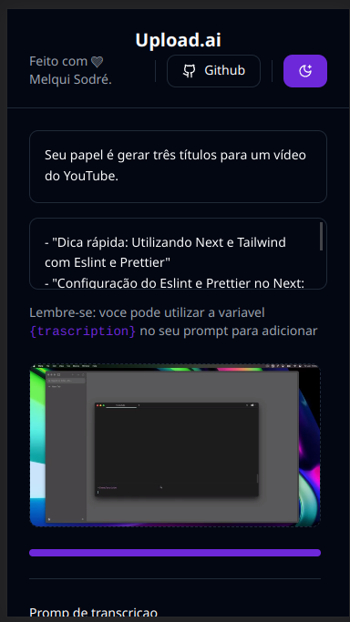
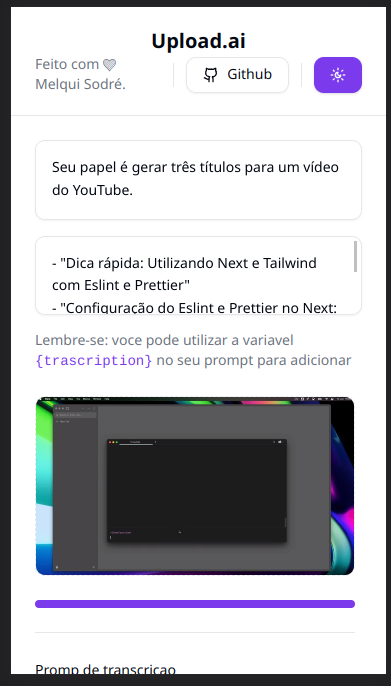
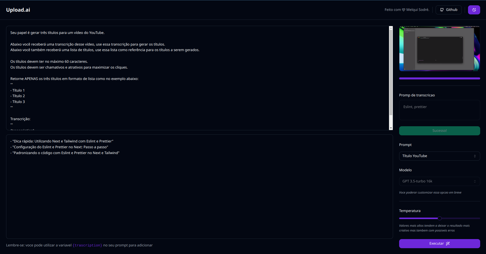
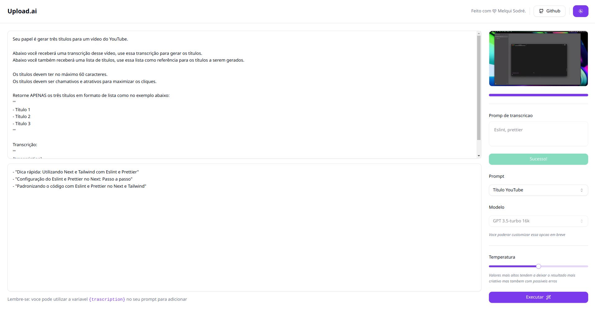

<h1 align="center" style="text-align: center;">
  upload.ai
</h1>

> Projeto desenvolvido na Trilha Mastery da NLW IA da Rocketseat.

<p align="center">
  <a href="#project">Projeto</a>&nbsp;&nbsp;&nbsp;|&nbsp;&nbsp;&nbsp;
  <a href="#technologies">Tecnologias</a>&nbsp;&nbsp;&nbsp;|&nbsp;&nbsp;&nbsp;
  <a href="#usage">Utilização</a>&nbsp;&nbsp;&nbsp;|&nbsp;&nbsp;&nbsp;
  <a href="#license">Licença</a>
</p>

<p align="center">
  
</p>

<h2 id="project">📁 Projeto</h2>

Esse projeto foi desenvolvido durante a NLW Ai da Rocketseat, o projeto e um gerador de titulos e descrições de videos, ele usa a Inteligencia artificial para gerar essas sujestões de titulos e descrições, aparti da transcrição do video.

O front-end do projeto está disponível neste repositório. Já o back-end está disponível [aqui](https://github.com/melquisedeque-magalhaes/upload-ai-api).






<h2 id="technologies">💻 Tecnologias</h2>

Este projeto foi desenvolvido utilizando tecnologias como:

- React
- TypeScript
- Shadcn
- ESLint
- Tailwind CSS
- Axios
- Vite
- FFmpeg
- Radix UI
- PostCSS

<h2 id="usage">💡 Utilização</h2>

Para executar a aplicação em sua máquina localmente, certifique-se de ter o `Node.js` e o `npm` instalados antes de prosseguir com as etapas abaixo:

1. Clone o projeto:

```
$ git clone https://github.com/melquisedeque-magalhaes/upload-ai-web
```

2. Acesse a pasta do projeto:

```
$ cd upload-ai-web
```

3. Instale as dependências:

```
$ npm install
```
ou
```
$ pnpm install
```
ou
```
$ yarn
```


4. Inicie o servidor:

```
$ npm run dev
```

<h2 id="license">📝 Licença</h2>

Este projeto está sob a licença MIT.

---

Feito com 💜 Melqui Sodré.

<div style="display: flex;">
  <a href="https://www.linkedin.com/in/melqui-sodre/" target="_blank"></a>
</div>